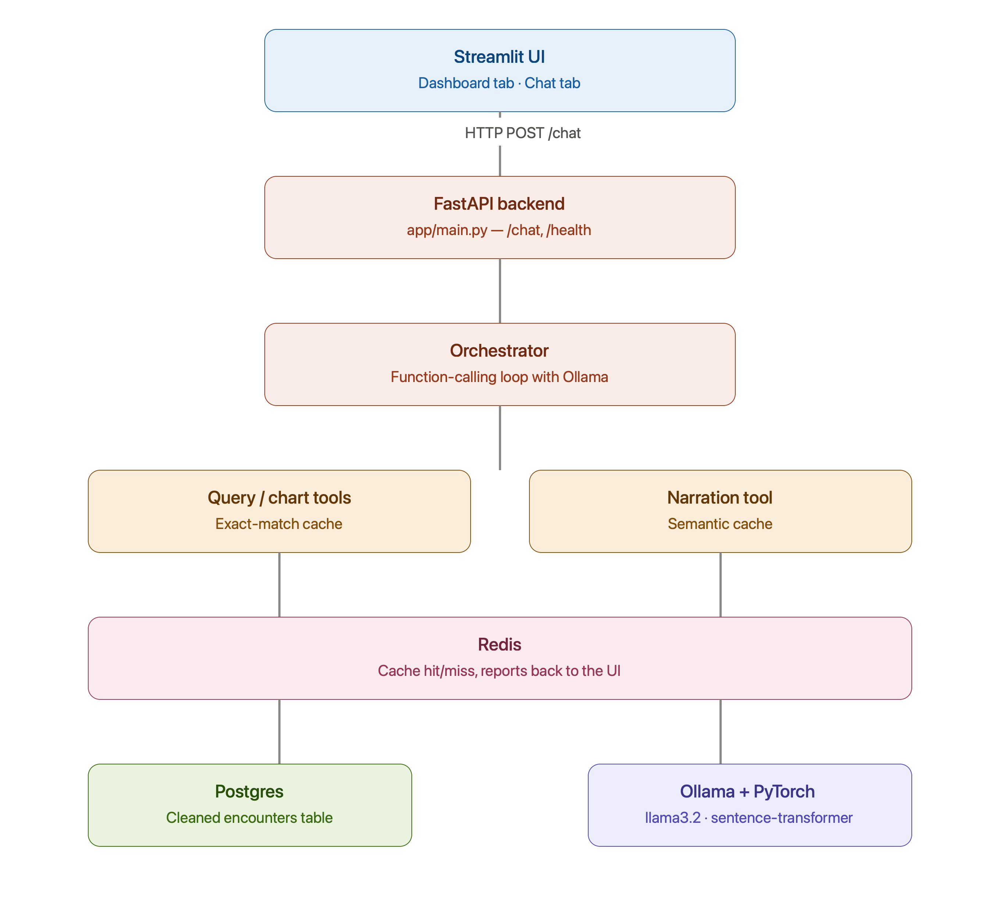
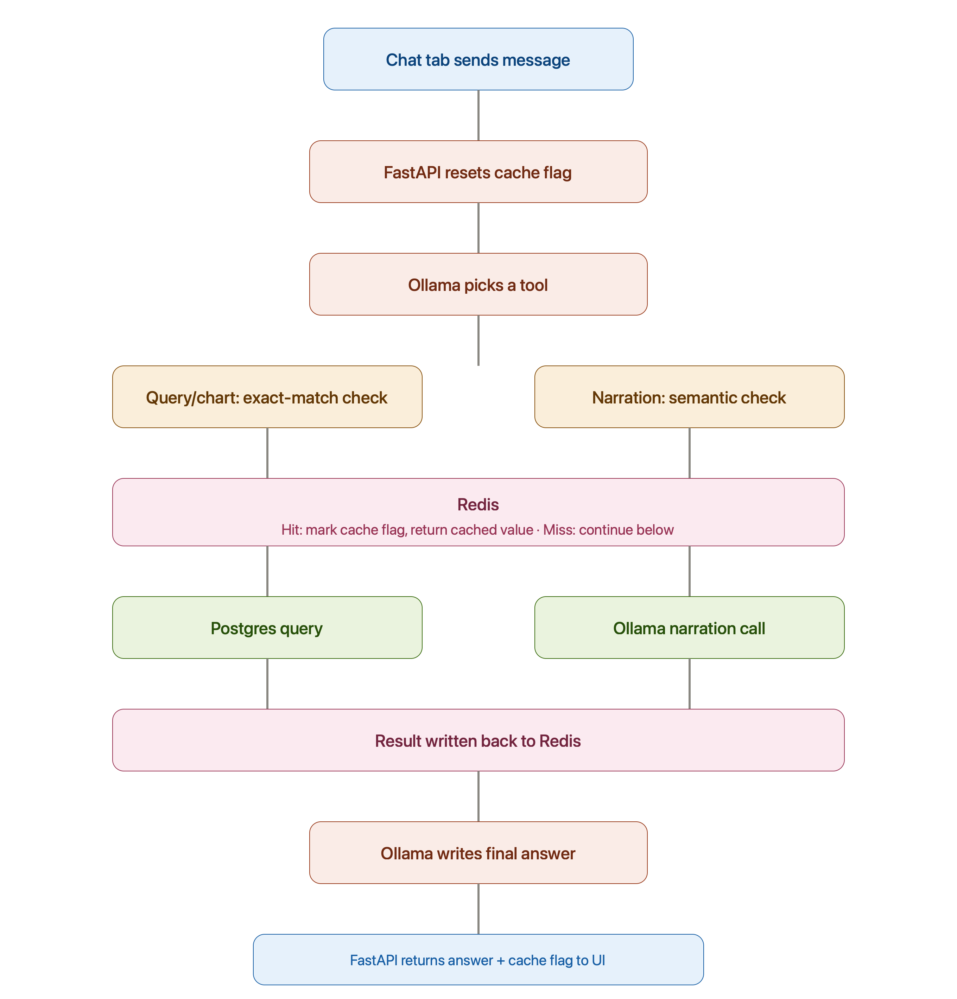
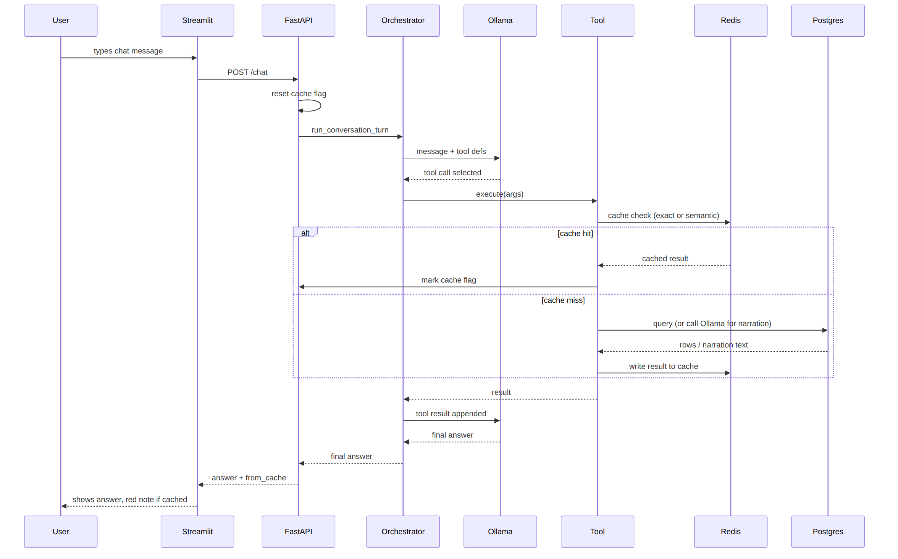

# Clinical Insights Copilot

Agentic AI copilot for exploring aggregate hospital data. A Streamlit dashboard provides filterable baseline charts, and a chat tab lets you ask questions in natural language — the agent queries the data, generates charts, or explains trends, backed by a local LLM (Ollama) and a Redis-cached tool layer.

## Status

- ✅ ETL + data layer
- ✅ Streamlit dashboard (non-agentic baseline)
- ✅ Agentic chat layer (orchestrator, tools, FastAPI backend, chat tab)
- ✅ Redis caching (exact-match for query/chart, semantic for narration)

## What it does

- **Dashboard tab** — filterable charts (Plotly) over a cleaned, aggregate hospital dataset
- **Chat tab** — ask a question in plain language; an agent decides which tool to use:
  - **Query**: "what's the average time in hospital by admission type?" → returns the numbers
  - **Text-to-viz**: "show readmission rate by age group" → generates a chart spec
  - **Insight narration**: "why is readmission higher for older patients?" → explains the pattern using the underlying data
- Repeated or semantically similar questions are served from cache — the UI shows a red **⚡ Served from cache** note when that happens

## Architecture

Monolith, chosen deliberately over a microservices split for this project's scope: one FastAPI backend, one Streamlit UI, calling each other over HTTP within the same repo.



- **ETL module** (`etl/`) — pandas pipeline: cleans the raw dataset, flags outliers (IQR method, never drops rows), decodes ID columns via `IDS_mapping.csv`, loads into Postgres
- **Streamlit UI** (`ui/`) — Dashboard tab (4 fixed charts) and Chat tab (calls the backend over HTTP)
- **FastAPI backend** (`app/`) — `/chat` and `/health`
- **Orchestrator** (`app/orchestrator.py`) — a function-calling loop, decoupled from any specific LLM SDK via dependency injection, capped at 5 tool-call iterations
- **LLM** — Ollama (`llama3.2`, local), called through an OpenAI-compatible adapter
- **Tools** (`app/tools.py`) — `query_data`, `generate_chart` (exact-match cached), `narrate_insight` (semantic cached, and itself makes an LLM call to generate the explanation)
- **Redis** — exact-match cache keyed on tool name + arguments for query/chart; semantic cache for narration, using a PyTorch sentence-transformer (`all-MiniLM-L6-v2`) to embed questions and match by cosine similarity, so paraphrased questions still hit
- **Postgres** — the cleaned data store

### Request flow



### Sequence



## Tech stack

| Layer | Choice |
|---|---|
| UI | Streamlit |
| Backend | FastAPI |
| Agent orchestration | Custom function-calling loop (provider-agnostic via dependency injection) |
| LLM | Ollama (`llama3.2`), OpenAI-compatible endpoint |
| Data processing | pandas |
| Database | Postgres |
| Cache | Redis (exact-match + semantic) |
| Embeddings | PyTorch, `sentence-transformers` (`all-MiniLM-L6-v2`) |
| Charts | Plotly |
| Testing | pytest, 45 unit tests |

## Dataset

Public, aggregate, non-PII hospital dataset (UCI "Diabetes 130-US hospitals" — encounter-level, no patient identifiers). This project is explicitly **not** patient-specific or diagnostic — it works on aggregate/cohort-level data only, and does not offer clinical advice. The chat agent's system prompt reinforces this: it's instructed to answer only from the dataset via its tools, not from general pretrained knowledge, and to say so plainly when a question falls outside what the tools can answer.

`IDS_mapping.csv` (included, small) decodes `admission_type_id`, `discharge_disposition_id`, and `admission_source_id` into human-readable descriptions during ETL — needed so chart axes and narration text are interpretable rather than showing raw numeric codes.

## Project layout

```
clinical-insights-copilot/
├── etl/
│   ├── config.py         # required env vars, no fallback defaults
│   ├── clean.py            # missing values, dtypes, ID decoding, outlier flagging
│   ├── mappings.py          # parses IDS_mapping.csv
│   ├── load.py                # writes cleaned data to Postgres
│   └── run.py                   # entrypoint: python -m etl.run
├── app/
│   ├── config.py          # Ollama/FastAPI/Redis env vars
│   ├── orchestrator.py      # the function-calling loop
│   ├── llm_client.py          # Ollama adapter (OpenAI-compatible)
│   ├── tool_schemas.py          # 3 tool schemas for function calling
│   ├── data_query.py              # generic metric/groupby aggregation
│   ├── data_access.py               # framework-free Postgres read
│   ├── tools.py                       # query_data, generate_chart, narrate_insight
│   ├── cache.py                         # exact-match Redis caching
│   ├── semantic_cache.py                  # PyTorch-embedding semantic cache
│   └── main.py                              # FastAPI app: /chat, /health
├── ui/
│   ├── data_access.py     # st.cache_data wrapper around app/data_access.py
│   ├── charts.py            # 4 dashboard chart-data functions
│   ├── chat_client.py         # HTTP client calling FastAPI /chat
│   └── app.py                   # Streamlit entrypoint: dashboard + chat tabs
├── tests/                  # 45 unit tests
├── data/
│   ├── raw/                # place diabetic_data.csv here (not checked in — ~19MB)
│   └── processed/
├── requirements.txt
└── .env.example
```

## Design trade-offs

- **Monolith over microservices** — kept deliberately simple for this project's scope; one repo, two processes (FastAPI + Streamlit) talking over HTTP, easy to run locally.
- **Aggregate, non-PII dataset** — avoids liability concerns that come with patient-specific or diagnostic tooling; reinforced by the chat agent's system prompt.
- **Required env vars, no defaults** — `etl/config.py` and `app/config.py` fail loudly at import time if any required variable is missing, rather than silently falling back to a value that may not match the local setup.
- **Orchestrator decoupled from the LLM SDK** — `llm_call` is injected as a dependency, not imported directly. This is what makes the whole agentic loop unit-testable without a real API key, and is why swapping from a hosted provider to local Ollama only required writing one new adapter file, not touching the loop itself.
- **Outliers are flagged, never dropped** — every row is preserved with a `<column>_is_outlier` boolean. Known limitation: the IQR method over-flags a few zero-inflated count columns (e.g. `number_outpatient`) since Q1=Q3=0 for many rows — noted for a future revisit, not yet fixed.
- **Exact-match vs. semantic caching** — query and chart results are deterministic given their arguments, so an exact-match key is sufficient and cheap. Narration is free-text and benefits from semantic matching, at the cost of an embedding step and a similarity search instead of a direct key lookup.
- **Minimal cache invalidation** — a simple TTL (10 minutes) is used rather than tracking ETL runs and explicitly flushing keys, to keep the caching layer simple for this project's scope.
- **Local LLM (Ollama) over a hosted API** — zero cost, no rate limits, works offline; trade-off is response latency depends on local hardware rather than a fast hosted inference service.

## Getting started

```bash
# clone and install
git clone <repo-url>
cd clinical-insights-copilot
pip install -r requirements.txt

# set environment variables — all are required, no defaults
cp .env.example .env
# edit .env if your local Postgres/Redis/Ollama setup differs from the defaults

# place the raw dataset (download from UCI; not checked into the repo)
# data/raw/diabetic_data.csv

# make sure Postgres and Redis are running, and Ollama is serving llama3.2
ollama pull llama3.2   # if you haven't already

# run the ETL once to populate Postgres
python -m etl.run

# start the backend (terminal 1)
uvicorn app.main:app --reload

# start the UI (terminal 2)
streamlit run ui/app.py
```

Run tests with:

```bash
pytest tests/
```

## Possible future improvements

- IQR outlier flagging over-flags zero-inflated count columns (`number_outpatient`, `number_emergency`, `number_inpatient`) — not yet addressed.
- No explicit cache invalidation tied to ETL re-runs; relies on TTL expiry.
